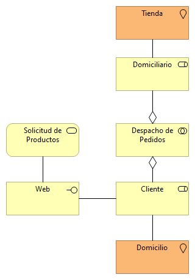
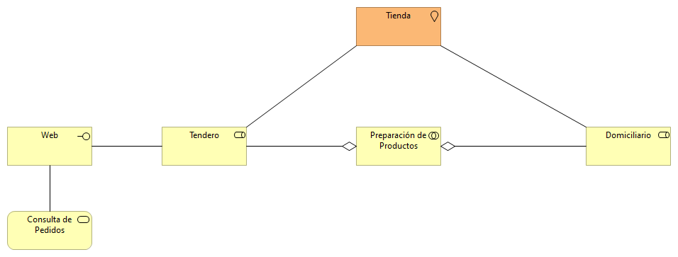
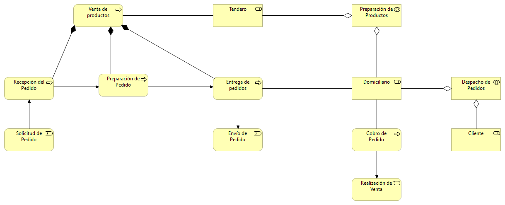
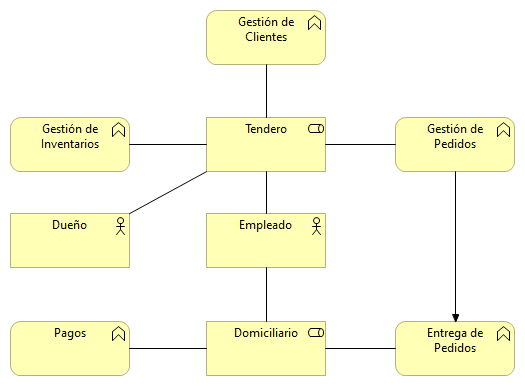
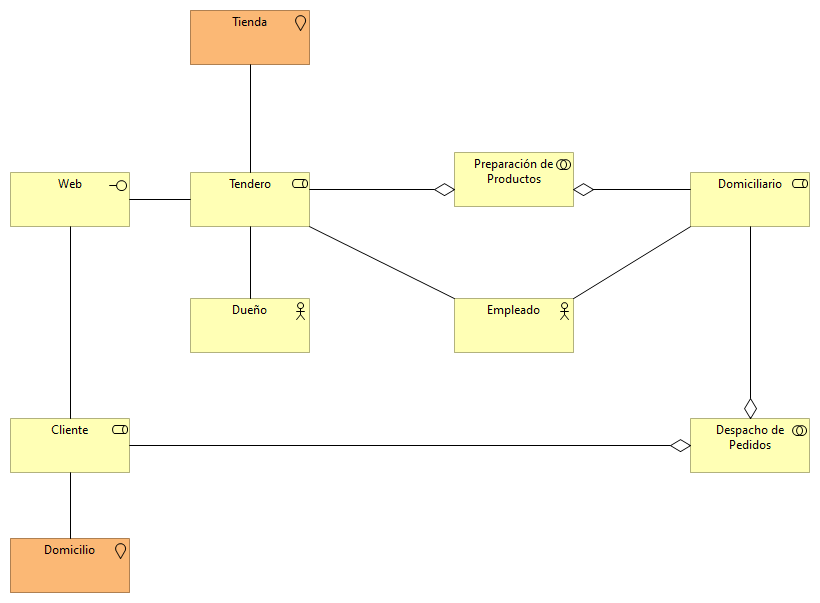
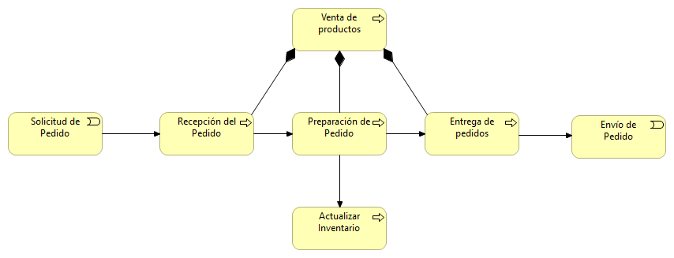
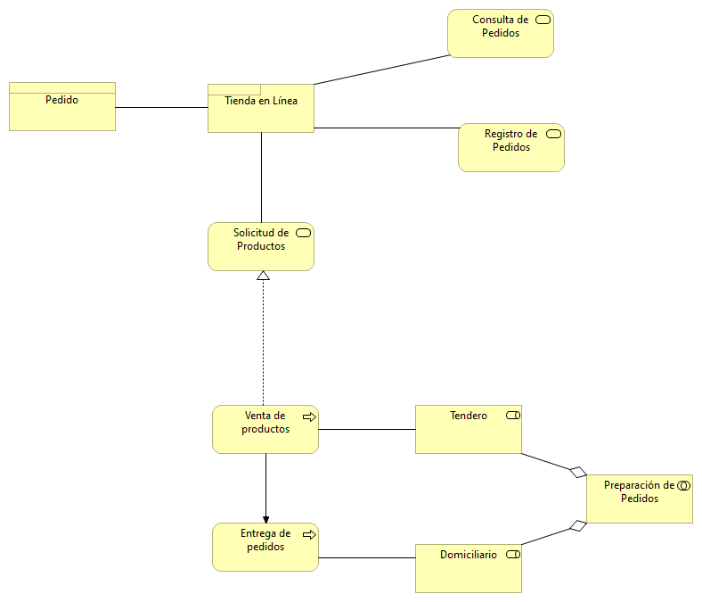
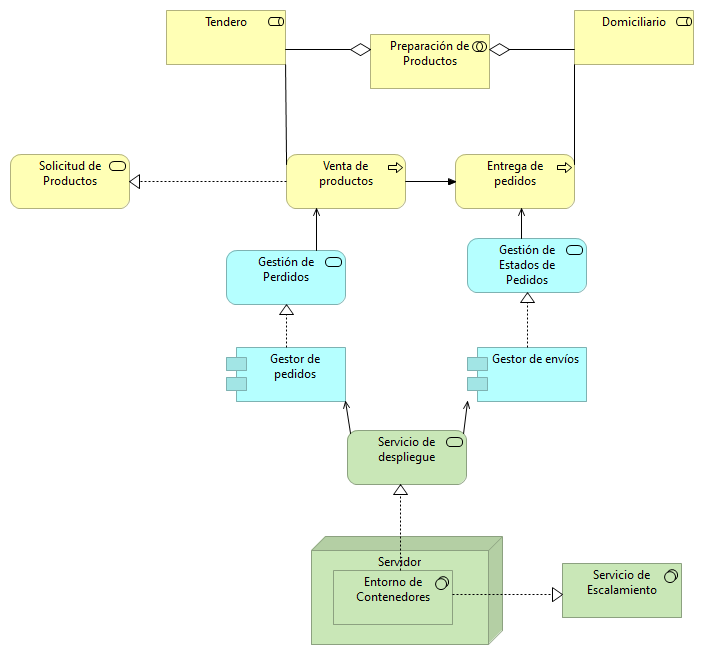

# Informática I: Tienda de Barrio
Integrantes
Diana Paola Villalobos Muñoz
Helberth Alberto Calderon Duran

Repositorio para los artefactos de software de la tienda de barrio

## Historias de Usuario

**Cliente:**

- Como cliente necesito visualizar el catálogo de productos.
- Como cliente necesito poder agregar productos al carro de compras.
- Como cliente necesito poder modificar el carrito de compras.
- Como cliente necesito poder hacer la compra con los artículos del carro.
- Como cliente necesito poder visualizar las compras hechas anteriormente.
- Como cliente necesito poder especificar mis datos personales.
- Como cliente necesito poder especificar el método de pago.
- Como cliente necesito poder visualizar el estado del pedido.

**Administrador - Dueño de la tienda:**

- Como administrador necesito visualizar los productos más vendidos.
- Como administrador necesito poder agregar tenderos.
- Como administrador necesito poder agregar domiciliarios.
- Como administrador necesito poder modificar información de los tenderos.
- Como administrador necesito poder visualizar los clientes que han realizado las mayores compras.
- Como administrador necesito poder visualizar los clientes que compran con mayor frecuencia.

**Tendero - Encargado del mantenimiento y control de los productos:**

- Como tendero necesito poder mostrar en catálogo los productos.
- Como tendero necesito poder editar la cantidad de productos disponibles.
- Como tendero necesito poder ocultar los productos del catálogo.
- Como tendero necesito poder agrupar los productos en categorías dentro del catálogo.
- Como tendero necesito poder modificar las categorías de los productos.
- Como tendero necesito saber el medio de pago del producto, si es con efectivo debo saber con cuánto pagará el cliente.

**Proveedor de productos (Pueden haber varios por cada tipo de producto y/o marca)**

- Como proveedor necesito poder crear productos dentro de las categorías.
- Como proveedor necesito poder modificar productos dentro de las categorías.
- Como proveedor necesito poder eliminar productos dentro de las categorías.
- Como proveedor necesito poder visualizar los productos más vendidos.
- Como proveedor necesito poder visualizar los productos menos vendidos.

**Domiciliario:**

- Como domiciliario necesito visualizar los productos solicitados.
- Como domiciliario necesito visualizar la cantidad de pedidos realizados por cliente.
- Como domiciliario necesito visualizar la cantidad de productos disponibles.
- Como domiciliario necesito visualizar los datos de entrega de pedido.
- Como domiciliario necesito visualizar el estado actual del cliente.
- Como domiciliario necesito visualizar la mejor ruta.

## Puntos de Vista de Archimate

**Cooperación despacho de pedidos:**

**Cooperación preparación de pedidos:**

**Cooperación Procesos de Negocio:**

**Funciones de Negocio:**

**Organización:**

**Procesos de Negocio:**

**Producto:**

**Tienda por capas:**

